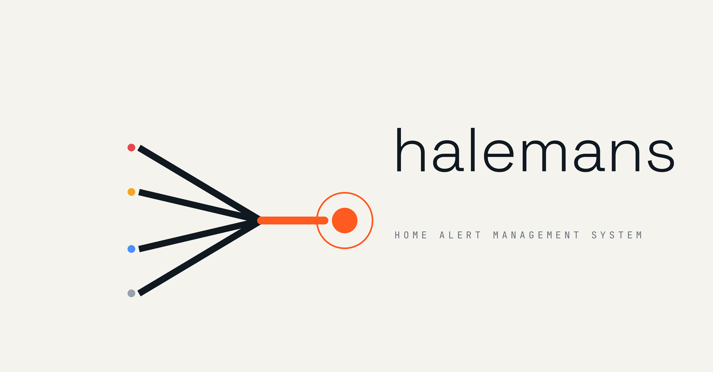

# Halemans

<picture>
    <source media="(prefers-color-scheme: dark)" srcset="images/halemans-lockup-dark.png">
    <source media="(prefers-color-scheme: light)" srcset="images/halemans-lockup-light.png">
    
</picture>

**H**ome **ALE**rt **MAN**agement **S**ystem — a single-node alert aggregation and management server. It collects alerts from Zabbix, Grafana, Prometheus Alertmanager and generic webhooks, deduplicates and groups them, enriches them with CMDB/Jira/Jira Assets/LLM context, and presents a unified operational picture to SRE teams.

Built with Haskell + [IHP](https://ihp.digitallyinduced.com/), PostgreSQL, server-rendered HSX UI and WebSocket live updates. All async work runs on a DB-backed job queue — no extra broker.

## Features

- **Multi-source ingestion** — polling connectors (Zabbix JSON-RPC, Grafana unified alerting) and webhook endpoints (Alertmanager, generic), with cursor-based idempotent polling and fingerprint dedupe.
- **Alert pipeline** — normalize → dedupe → blackout check → grouping rules → state machine (firing / ack / resolved / closed / suppressed) → notification dispatch. Every mutation lands in an append-only audit log.
- **Grouping & dedup** — DB-backed ordered grouping rules; exact dedupe by source-scoped fingerprint with occurrence counters.
- **Teams & RBAC** — roles as data (composable privilege sets), team-based notification/escalation routing, blackouts (maintenance windows) per environment/host/service.
- **Context enrichment** — Confluence CMDB lookup (TTL-cached), Jira issue linking/status sync, Jira Assets object linking with served icon cache, hybrid write-back (ack/close/silence propagated back to Zabbix/Grafana/Alertmanager).
- **LLM enrichment** — advisory-only analysis (probable cause, suggested actions) via any OpenAI-compatible endpoint; agent roles with tool filtering, prompt-hash dedupe, retry with backoff, per-DB provider config.
- **Facets & custom dashboards** — facet extraction from fields/labels/Assets attributes via ranked field mappings, per-user dashboards with match/groupBy/summary/forEach card templates, live-updated over WebSocket.
- **Live UI** — server-rendered pages with WebSocket fragment updates, per-environment scopes, browser notifications, theme packs.
- **Public API & metrics** — read-only JSON API (`/api/v1/alerts`, `/api/v1/environments`) with per-token rate limits, `/metrics` Prometheus exporter, audit export (CSV/JSONL).
- **Provisioning** — declarative JSON config (users/teams/sources/rules) applied idempotently at boot; env-var indirection for secrets.
- **Source health** — connector failure tracking with exponential backoff, webhook silence detection, reverse state reconciliation (acks, silences, missed resolves), internal health alerts.

Full design: [`design_docs/01_highlevel.md`](design_docs/01_highlevel.md); per-milestone notes in `design_docs/milestone_*.md`.

## Quick start (development)

Requires Nix with flakes.

```bash
# Full dev stack: postgres, app (port 28080), worker, mocks, zabbix/grafana/alertmanager
nix develop .#default --impure -c devenv-flake-up -D

# Status / logs
process-compose -u /run/user/1000/devenv-*/pc.sock process list
```

The dev stack seeds demo users, sources and a random API token (into `.devenv/state/halemans/api-token`). Tokens for the bundled Zabbix/Grafana/Alertmanager live in `.devenv/state/` (gitignored).

Useful commands inside the dev shell:

```bash
seed           # idempotent seeding
stack-status   # health report
smoke-test     # end-to-end smoke suite (needs running stack)
```

## Testing

```bash
nix flake check --impure
```

This is the canonical check: it builds the project and runs unit tests, integration tests and the full sandboxed smoke suite (three sources, prod binaries, Playwright browser tests). For fast iteration:

```bash
ghci -v0 Test/Main.hs -e 'main'                  # unit tests
ghci -v0 Test/Integration.hs -e 'main'           # integration tests (needs DATABASE_URL)
```

## Deployment (Docker, no Nix required)

Pre-built images carry the server, worker, schema bootstrap and password tool:

```bash
cd deploy/docker
cp .env.example .env                       # fill in required values
cp provision.example.json provision.json
docker run --rm ghcr.io/gvnkd/halemans:latest /bin/GenPassword 'your-plaintext-password'
# paste the printed hash into provision.json (users.items[].passwordHash)
docker compose up -d
```

The app listens on `HALEMANS_PORT` (default 8000). `provision.json` is re-applied on every boot — edit and `docker compose up -d --force-recreate app worker` to update. Images are built by GitHub Actions (`.github/workflows/docker-images.yaml`) and pushed to `ghcr.io/gvnkd/halemans:{latest,sha,v*}` (override with `HALEMANS_IMAGE` if you host your own).

See [`deploy/docker/.env.example`](deploy/docker/.env.example) for all configuration options (source tokens, Jira/Confluence, LLM endpoint, session secret).

## Zabbix token permissions

Halemans authenticates to Zabbix with an API token (`Authorization: Bearer`, referenced from source config via `tokenEnv`). In Zabbix ≥ 6.4 token permissions come from the user's **role** (Administration → User roles → *API access* → allowed methods) plus the user's **host group permissions** — `event.get` only returns events for hosts the token's user can read. Grant read access to the relevant host groups via the user's group membership.

A **read-only** token needs two API methods:

| Method | Required | Used for |
|---|---|---|
| `event.get` | **yes** | Trigger event polling (problem/OK) and ack-state reconciliation |
| `trigger.get` | recommended | Resolved-state reconciliation: alerts whose OK event was missed (outage, purged history) are resolved locally from the trigger's current value. Without it that safety net is off (polling still works) |
| `user.get` | optional | Resolving ack author names when mirroring Zabbix acks; without it acks still mirror, but the actor shows as a raw userid |
| `hostgroup.get` | optional | The "Sync host groups" button (host-group cache for `hostGroupScope: "teams"`). Skip it when provisioning the cache from `hostGroupsFile` instead |

`event.acknowledge` is called only when the source config sets `"writeBack": true` — with write-back enabled the token is no longer read-only.

Quick check that a token is sufficient (this is the exact call the poller makes):

```bash
curl -s -X POST 'https://<zabbix>/api_jsonrpc.php' \
  -H 'Content-Type: application/json-rpc' -H "Authorization: Bearer $ZABBIX_TOKEN" \
  --data '{"jsonrpc":"2.0","method":"event.get","id":1,"params":{"source":0,"object":0,"limit":1}}'
```

A `result` array (even empty) means the polling path works; an `error` object like `No permissions to call "event.get"` means the role's API allow-list is missing the method. At runtime the rpc error text is shown verbatim in the source's `last_error` on the Sources page.

### Zabbix reconciliation tuning

Cursor-based polling only ever returns *new* events, so an OK event missed while Zabbix was unreachable could leave an alert firing forever. Each poll cycle the poller additionally re-checks the current value of every trigger behind a tracked (firing/ack) alert with **one batched `trigger.get` call** and resolves locally whatever Zabbix no longer reports as a problem, back-dating `resolved_at` to the trigger's `lastchange`. Behavior is tunable per source via `config` keys (shown with defaults):

```json
{
  "reconcileResolved": true,
  "reconcileGraceSeconds": 60,
  "reconcileIntervalSeconds": 0,
  "absentResolveMinAgeSeconds": 86400,
  "eventPageLimit": 1000
}
```

- `reconcileGraceSeconds` — minimum age of the last local activity before source state is trusted (guards the ingest/reconcile race on refires).
- `reconcileIntervalSeconds` — minimum seconds between reconciles; `0` means every poll cycle.
- `absentResolveMinAgeSeconds` — a trigger *missing* from `trigger.get` (deleted, or invisible to the token) resolves the local alert only when the alert is older than this; guards against token permission gaps hiding triggers.
- `eventPageLimit` — `event.get` page size; catch-up after an outage pages until a short page, so no events are skipped.

## API

- `GET /api/v1/alerts`, `GET /api/v1/alerts/:id`, `GET /api/v1/environments` — read-only JSON, bearer-token auth (`api_tokens` table, managed via the profile UI), per-token rate limits.
- `GET /metrics` — Prometheus exporter.
- `POST /hooks/alertmanager/:token`, `POST /hooks/generic/:token` — ingestion webhooks.
- `GET /admin/audit/export` — audit log export (CSV/JSONL, admin only).

## Project layout

| Path | Contents |
|---|---|
| `Application/` | domain logic: connectors, pipeline, jobs, services, schema, migrations |
| `Web/` | controllers, views (HSX), websocket broadcaster |
| `Config/`, `Main.hs`, `WorkerMain.hs` | IHP wiring: web and worker entry points |
| `design_docs/` | high-level design + per-milestone docs |
| `nix/` | dev environment, checks, mocks, scripts |
| `deploy/docker/` | contained production deployment |
| `Test/`, `tests/` | hspec unit/integration tests, smoke suite |
| `flake.nix` | build, dev shell, checks, docker image |

## CI

`.github/workflows/nix-flake-check.yml` runs `nix flake check --impure -L` on every push/PR to `master`, using the digitallyinduced Cachix cache and Magic Nix Cache.
